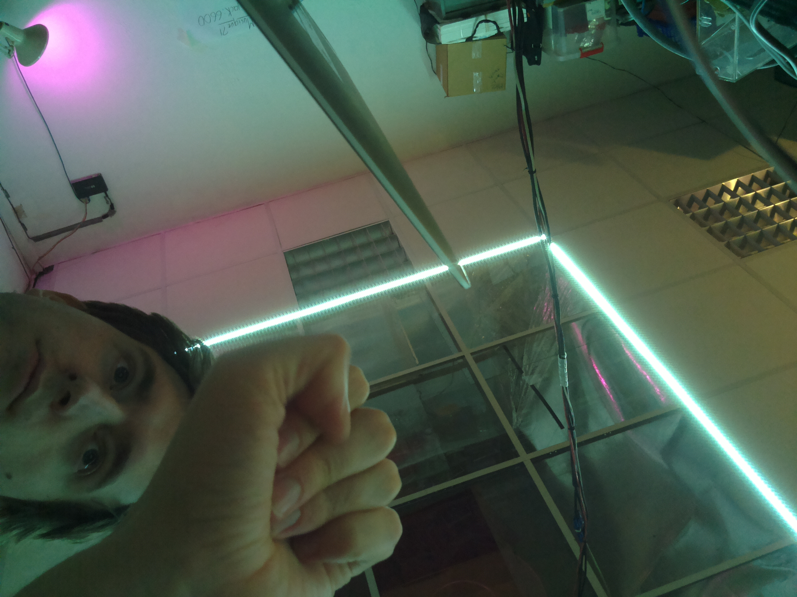

# Raspberry Pi Compute module

le rpi compute module est sans emplacement card micro-SD, toute sa mémoire dure est dans une flash de 4Go env. 

### articles interessants

- [flasher le CM EMMC sous mac](http://www.uugear.com/portfolio/flashing-the-raspberry-pi-compute-module-emmc-under-mac-os/)

### flash

J'ai eu un peu de mal à booter sur le compute module depuis mon mac book pro.
J'ai finis par utiliser un autre Rpi B+ comme intermédiaire, car c’est plus simple de booter/flasher sur Raspbian.

## activer le SSH sur un CM

suivant [cet article](https://www.thepolyglotdeveloper.com/2016/06/connect-raspberry-pi-zero-usb-cable-ssh/)

il faut booter le CM, via 

	sudo ./rpiboot
	
puis repérer le volume monté via `mount`

	/dev/sda1 on /media/boot type vfat (rw,nosuid,nodev,relatime,uid=1000,gid=1000,fmask=0022,dmask=0077,codepage=437,iocharset=ascii,shortname=mixed,showexec,utf8,flush,errors=remount-ro,uhelper=udisks)
	/dev/sda2 on /media/0aed834e-8c8f-412d-a276-a265dc676112 type ext4 (rw,nosuid,nodev,relatime,data=ordered,uhelper=udisks)

`/dev/sda1` correspond au boot du CM. 

on rentre sur ce dossier

	cd /media/boot
	
on édite — via `vim` — `config.txt` en ajoutant	, à la fin du fichier

	dtoverlay=dwc2

puis le fichier `cmdline.txt` en ajoutant, après `rootwait` 

	modules-load=dwc2,g_ether

on créé aussi un fichier `ssh` via `touch ssh` à la racine du boot
(mais je sais pas si c’est utile) 

	UPDATE 12/11/2016: As pointed out by some readers, 
	the Raspberry Pi Foundation is disabling SSH 
	by default in Raspbian Pixel as a security precaution.  
	More information on the subject can be found here.  
	To enable SSH, create a file called ssh and save it 
	to the boot partition of the mounted drive.  
	The file can be blank, and it has no extensions.

### Multi-caméra

le Compute module est le seul pi a permettre l'usage de 2 caméras en simultané. 

La librairie Python PiCamera gère d’ailleurs spécialement un [mode stéréo pour le Compute Module](http://picamera.readthedocs.io/en/release-1.12/api_camera.html#picamera)

le kit de dévellopement CM contient un adaptateur 15W vers 22W pour la caméra (et aussi un autre pour le display)

### modifier le clavier

	sudo dpkg-reconfigure keyboard-configuration
	
### Photos !

	
