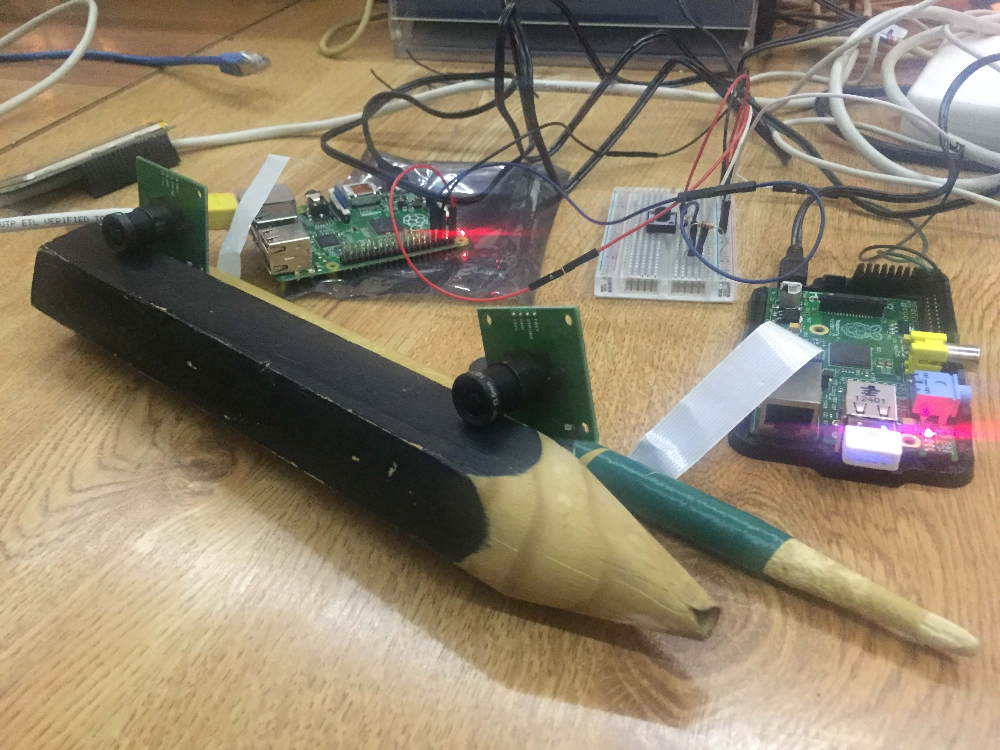

# notes
notes du projet polyptyque

petits morceaux à copier coller…

### mount sshfs

commande pour monter un rpi en ssh, sur le dossier home/pi

	sudo sshfs -o allow_other,defer_permissions pi@192.168.2.32:/home/pi raspberrypi/pi
	
remplacer l'IP par celle du RaspberryPi	

### trouver l’ip du `raspberry pi` via `nmap`

Le Pi est connecté en direct à l’USB via la commande, sur l’adaptateur USB/RJ45 de mon macbookPro :

	nmap -sn 192.168.2.0/24
	
Cette commande sert à scanner les ip sur une plage d’adresse. Il faut installer nmap, car non présent par défaut. 

### MAC addresses

Pi B+

	wlan0 : 00:c1:40:59:0e:59 
	eth0 : b8:27:eb:b4:d2:4b

Pi 2

	eth0 : b8:27:eb:7f:52:0b

### faire une photo de test, via `raspistill`

	raspistill -o cam-test-$(date +%Y-%m-%d_%H-%m-%S).jpg
	
### synchronisation !

à + ou - 500 ms c’est pas encore ça

`img-2016-11-24_13-51-36_A.jpg` :

`img-2016-11-24_13-51-36_B.jpg` :	

### montage du 24 novembre

avec les [scripts pythons](python) 

### montage du 30 novembre

on approche de quelque chose, avec un projecteur en pleine face.
même si il y a encore des problèmes de ratio. 

et le montage, qui tiens avec des gros crayons et des baguettes !

### Compute Module

les notes sur le RPI Compute Module et son IO dev kit sont sur cette page : 
[CM Notes](CMnotes.md)
