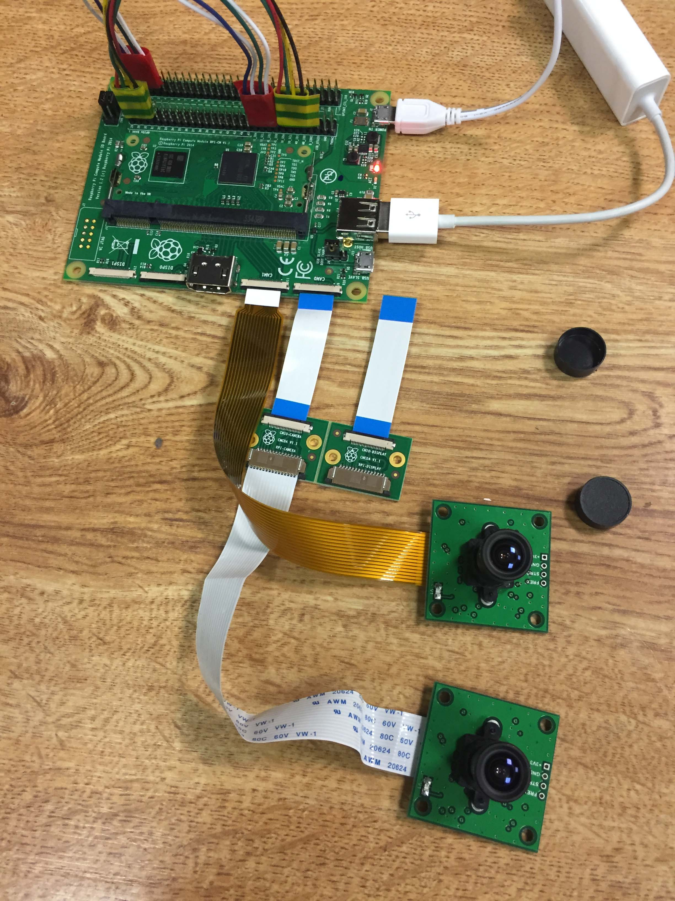
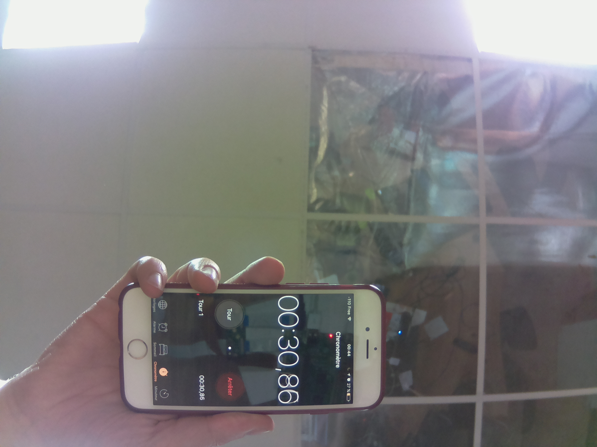
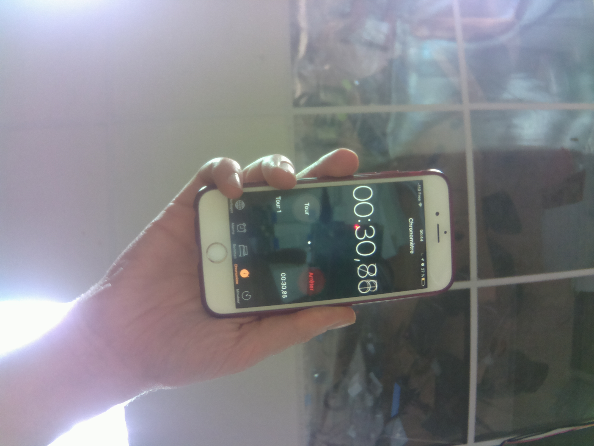
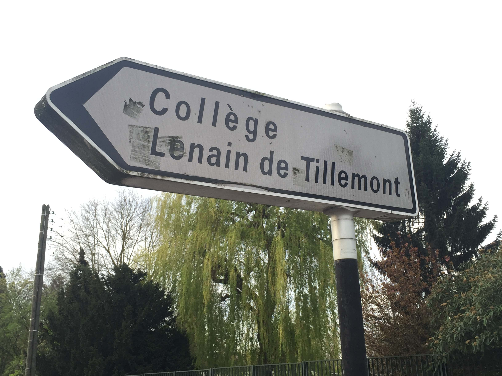
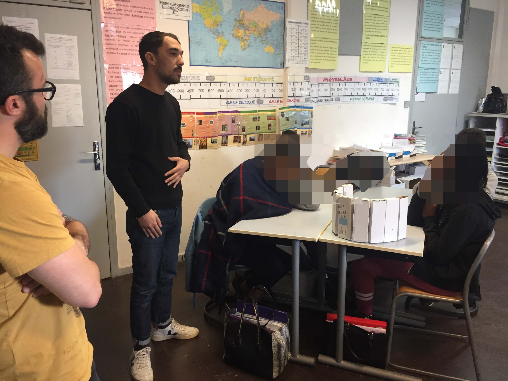
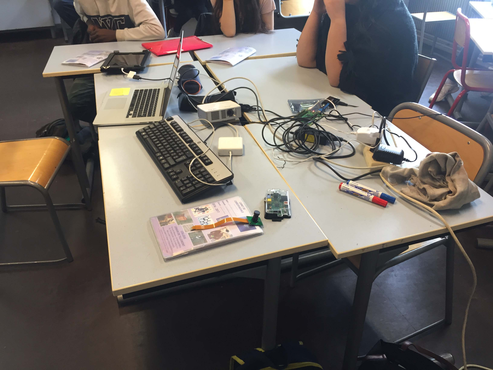
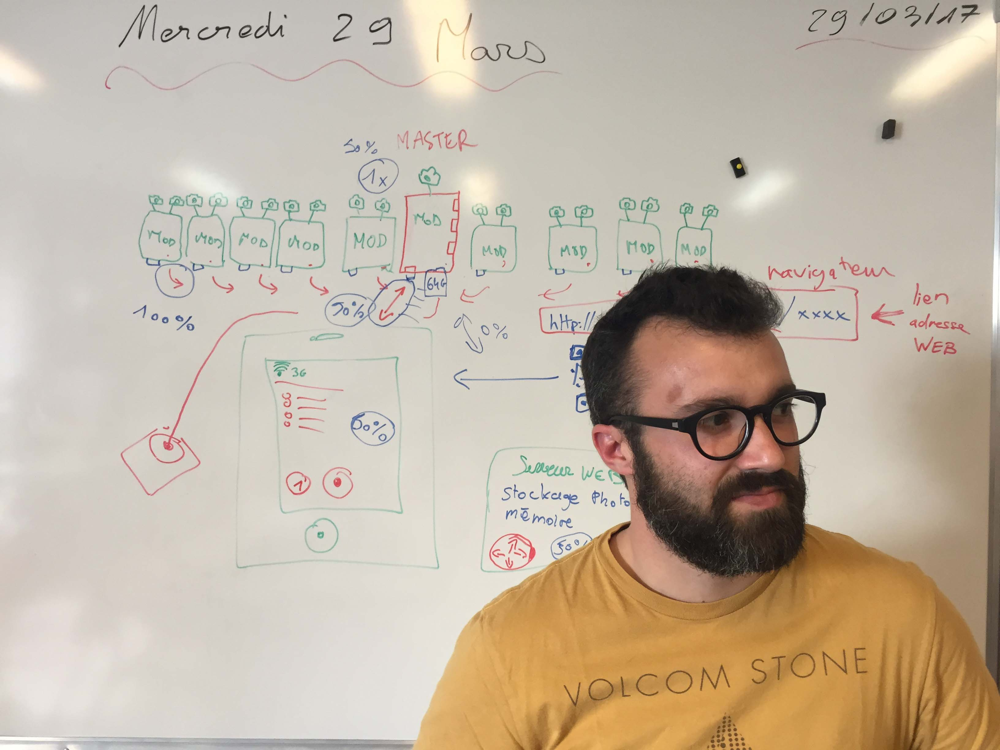

### 14 avril

Les versions slave-module et master-module progressent. 

Cela signifie qu’aujourd’hui, depuis un navigateur web, via un site accessible en `localhost` (sur les lieux de l’installation, dans une web-app...), on peut saisir le formulaire, puis cliquer sur le declencheur photo sur la dernière étape, et cela envoie une requête HTTP `POST` au master-module. 

À cette requête HTTP, le master-module renvoie lui même un datagram `UDP`, 

en mode `BROADCAST`, c’est à dire à tout ceux qui veulent bien gérer ce message. En l’occurrence tous les slave-module. Aujourd'hui on a fait le test avec un seul CMIO, et ça marche (même en wifi) ! 

Ensuite nous avons implémenté sur le slave-module, à la réception du message UDP, un déclenchement de la prise de vues sur 2 caméras et c’est fonctionnel. reste à optimiser le temps de traitement car les prises de vues étaient faites successivement, avec un temps d'écriture des fichiers, faible, mais réel, environ 1/4 de seconde. 

### 9 avril

Le site [polyptyque.photo](http://polyptyque.photo/) était déjà en ligne avec une démo interactive depuis le 29 mars. Mais cette démo utilisait les images assemblées à la main — sur Photoshop® — par Bertrand. Ce soir une nouvelle fonctionnalité est dévellopée, le mélange par mode de fusion (blending mode) et opacité, via la librairie node canvas. 
[mix A-B](http://polyptyque.photo/demo-mix-A-B) et [mix B-A](http://polyptyque.photo/demo-mix-B-A).

L’algorithme est le suivant : 

- On a deux ensembles `A` & `B` composés de 19 images chacun :
	- 1 image centrale, notée `0`
	- 9 images à droite, numérotées de `r1` à `r9`, où `r1` est la plus proche de `0`
	- 9 images à gauche, numérotées de `l1` à `l9`, sur le même principe
- Le mode de fusion utilisé est `darker` (_obscursir_ en français) 
- Côté droit, `A` est fusionné à `B`. Côté gauche, c’est l’inverse, `B` est fusionné à `A`. Au centre, peut importe car l’opacité de fusion est de `100%`
- Sur chaque côté, l’opacité varie en fonction de la position, dans notre cas avec un facteur multiplicateur de `11.11%`. Ainsi la dernière image `r9` est mélangée avec une opacité diminuée de 99.99% (arrondi à 100%, et donc invisible) 

Autre bonne nouvelle de cette fin de semaine, F93 a réceptionné pour le projet 10 Raspberry Pi Compute Module dev kit, ainsi que 20 caméras PiV2 !

### 6 avril

Ça y est, on est a réussi — *merci à Acathla du [jack](http://jack.tf) pour avoir bricoler la connectique pi camera cassé, c’était ça* — juste en ligne de commande pour l’instant, mais le programme python va suivre...

Et les résultats sont déjà concluant, même avec les réglages caméra automatiques. 

### 29 mars

Rendez-vous au collège Lenain-de-Tillemont pour montrer l’avancement du dispositif technique avec les élèves, et avec une intervention de Mathieu Marion de [F93](http://f93.fr)

On a fait un beau schéma au tableau

### 11 janvier

On arrive a se connecter au Compute Module (le port USB devient un port réseau). Et ensuite à prendre une photo, via le dev kit. Merci à Fabien pour son aide. 

### décembre 

Réception du Compute Module et démarrage pas toujours facile — car assez différent des autres RPi. Surtout à cause du fait qu'il n'a qu'un seul port USB, et pas de port Ethernet. 

### 30 novembre

on approche de quelque chose, avec un projecteur en pleine face, qui augmente la luminosité et donc diminue le temps de prise de vue.
même si il y a encore des problèmes de ratio. 

et le montage, qui tiens avec des gros crayons et des baguettes !

### 24 novembre
	
tentative de synchronisation : à + ou - 500 ms c’est pas encore ça

`img-2016-11-24_13-51-36_A.jpg` :

`img-2016-11-24_13-51-36_B.jpg` :	

avec les [scripts pythons](python) 

