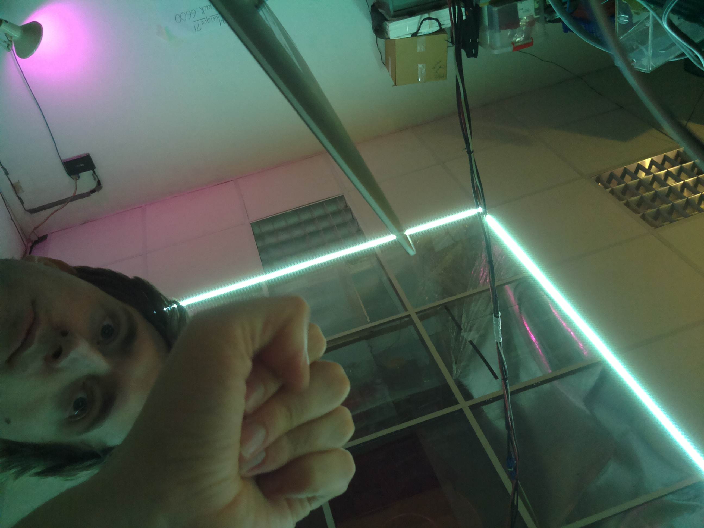

### 6 avril

Ça y est, on est a réussi — *merci à Acathla du [jack](http://jack.tf) pour avoir bricoler la connectique pi camera cassé, c’était ça* — juste en ligne de commande pour l’instant, mais le programme python va suivre...

Et les résultats sont déjà concluant, même avec les réglages caméra automatiques. 

### 29 mars

Rendez-vous au collège Lenain-de-Tillemont pour montrer l’avancement du dispositif technique avec les élèves, et avec une intervention de Mathieu Marion de [F93](http://f93.fr)

On a fait un beau schéma au tableau

### 11 janvier

On arrive a se connecter au Compute Module (le port USB devient un port réseau). Et ensuite à prendre une photo, via le dev kit. Merci à Fabien pour son aide. 

### décembre 

Réception du Compute Module et démarrage pas toujours facile — car assez différent des autres RPi. Surtout à cause du fait qu'il n'a qu'un seul port USB, et pas de port Ethernet. 

### 30 novembre

on approche de quelque chose, avec un projecteur en pleine face, qui augmente la luminosité et donc diminue le temps de prise de vue.
même si il y a encore des problèmes de ratio. 

et le montage, qui tiens avec des gros crayons et des baguettes !

### 24 novembre
	
tentative de synchronisation : à + ou - 500 ms c’est pas encore ça

`img-2016-11-24_13-51-36_A.jpg` :

`img-2016-11-24_13-51-36_B.jpg` :	

avec les [scripts pythons](python) 

